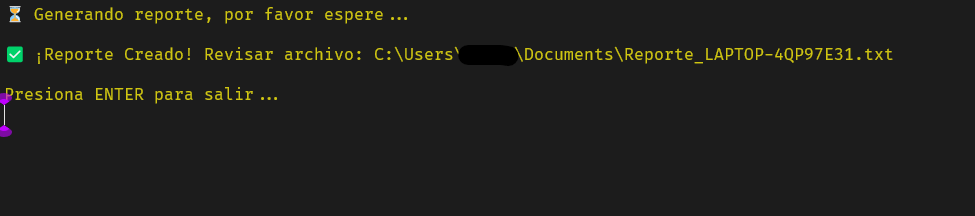
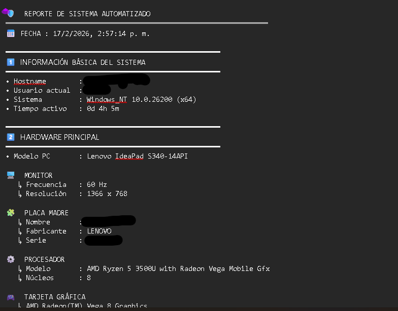
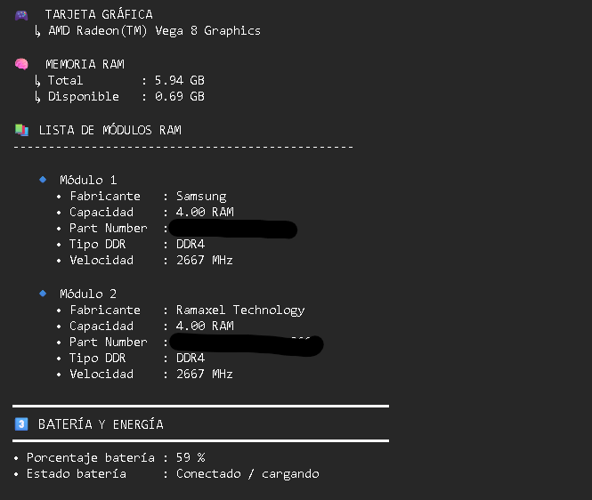
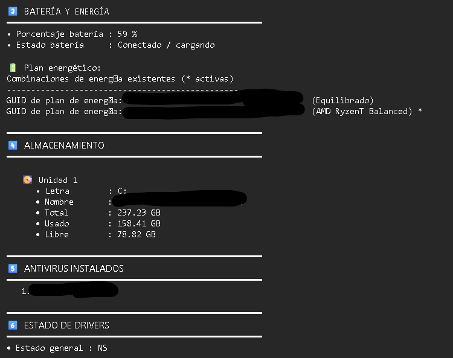

Saber qué componentes tiene tu computadora no debería ser complicado. Ya sea que quieras comprar más memoria RAM, verificar por qué tu disco está lleno o simplemente ver tu dirección IP, la información suele estar oculta detrás de menús confusos o comandos difíciles de recordar.

Para solucionar esto, he creado un **Script de Diagnóstico** (disponible en GitHub) que recopila todos los datos importantes de tu PC en segundos, sin necesidad de instalar programas pesados.

## El Problema: Comandos Difíciles de Recordar

Normalmente, para obtener información técnica real, tendrías que abrir la consola y escribir líneas complejas como estas:

* **Para el Disco:** `wmic logicaldisk get caption,freespace,size`
* **Para la RAM:** `wmic memorychip get Capacity,Speed,Manufacturer`
* **Para el Wi-Fi:** `netsh wlan show profiles`

Si no eres un experto, esto es tedioso y propenso a errores.

## La Solución: Información en un Click

Este proyecto automatiza todo ese proceso. He empaquetado esos comandos en una herramienta ejecutable que hace el trabajo duro por ti. Al abrirla, obtienes un reporte limpio con:

1. **`INFORMACIÓN BÁSICA DEL SISTEMA:`**
    * Muestra el nombre del equipo, el usuario actual, la versión exacta del sistema operativo y el tiempo de actividad (uptime).
2.  **`HARDWARE PRINCIPAL:`**
    * Un resumen de potencia: Modelo de la PC, procesador (CPU), tarjeta gráfica, placa madre y la resolución del monitor.
3.  **`LISTA DE MÓDULOS RAM:`**
    * Detalle técnico vital para upgrades: Fabricante, Tipo (DDR3/4/5), Velocidad (MHz) y capacidad de cada módulo instalado.
4.  **`BATERÍA Y ENERGÍA:`**
    * (Para Laptops) Visualiza el porcentaje real, estado de la batería y el plan energético activo.
5.  **`ALMACENAMIENTO:`**
    * Analiza tus particiones (C:, D:, etc.), mostrando el nombre del disco, su capacidad total, espacio usado y **espacio libre**.
6.  **`ANTIVIRUS INSTALADOS:`**
    * Detecta e identifica qué software de seguridad está protegiendo el equipo.
7.  **`ESTADO DE DRIVERS:`**
    * Realiza un escaneo rápido para reportar si algún controlador tiene fallas o errores.
8.  **`USUARIOS DEL SISTEMA:`**
    * Lista todas las cuentas de usuario registradas en la computadora.
9.  **`REDES Y CONECTIVIDAD:`**
    * Muestra tu dirección IP, Máscara de Subred, dirección MAC y recupera los perfiles Wi-Fi guardados (con sus contraseñas).

### Visualizando el Resultado

Una vez ejecutado, la herramienta genera un reporte limpio y organizado como el que ves en la imagen:

El script genera automáticamente un respaldo. Un archivo de texto llamado **`reportes.txt`** se guardará en tu carpeta de **Documentos**. Esto es ideal si necesitas guardar el diagnóstico o enviárselo a otra persona por correo.
## ¿Por qué usarlo?

Esta herramienta es para **`cualquier persona`** que necesite información rápida de una PC:

* **Diagnóstico Rápido:** Obtienes una "radiografía" del sistema al instante.
* **Portátil:** Puedes llevar el ejecutable en un USB y usarlo en cualquier computadora con Windows.
* **Sin Instalación:** No deja basura en el sistema; lo ejecutas, ves la info y listo.

## Proyecto Open Source

El código es totalmente transparente y gratuito. Puedes descargarlo, revisarlo o incluso mejorarlo si tienes conocimientos de programación.

> **[🔗 Codigo del Ejecutable desde GitHub ](https://github.com/z6nc/AuditoriaPC)**

> **[🔗 Descarga el Ejecutable desde mi GitHub](https://github.com/z6nc/AuditoriaPC/releases/tag/Ejecutables)**

---

## Conclusión

La tecnología debe facilitarnos la vida. Con este script, conocer las entrañas de tu computadora deja de ser un misterio para convertirse en una tarea de un solo clic.

¡Pruébalo y cuéntame qué te parece!